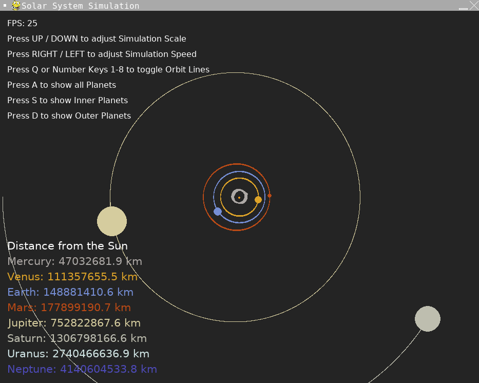

# 2D Solar System Simulation (v1.0)

2D simulation of our solar system using pygame.  
Based on the [YouTube](https://www.youtube.com/watch?v=WTLPmUHTPqo) tutorial by [@techwithtim](https://github.com/techwithtim/Python-Planet-Simulation) and inspired by tweaks and additions by [@zerot69](https://github.com/zerot69/Solar-System-Simulation).

## Screenshot

## Features

- Simulation of inner and outer planets
- Keyboard controls for scale and speed adjustment
- Toggle functionality for orbits and planets
- Display of planet distances to the Sun

## Setup

Install Python packages and run `main.py`.

**Dependencies:**
- pygame
- math
- itertools

## Project Structure

- `main.py` — Main loop, event handling, rendering with enhanced interactive controls
- `constants.py` — Physical constants, colors, planetary data
- `solarsystem.py` — Bodies and physics

# Sources

- Tech With Tim's tutorial: [YouTube](https://www.youtube.com/watch?v=WTLPmUHTPqo)
- Article by rastr-0: [teletype.in](https://teletype.in/@rastr_0/solar_system)
- Zerot69's Solar System Simulation: [GitHub](https://github.com/zerot69/Solar-System-Simulation)
- Planetary Data from NASA: [nssdc.gsfc.nasa.gov](https://nssdc.gsfc.nasa.gov/planetary/factsheet/)