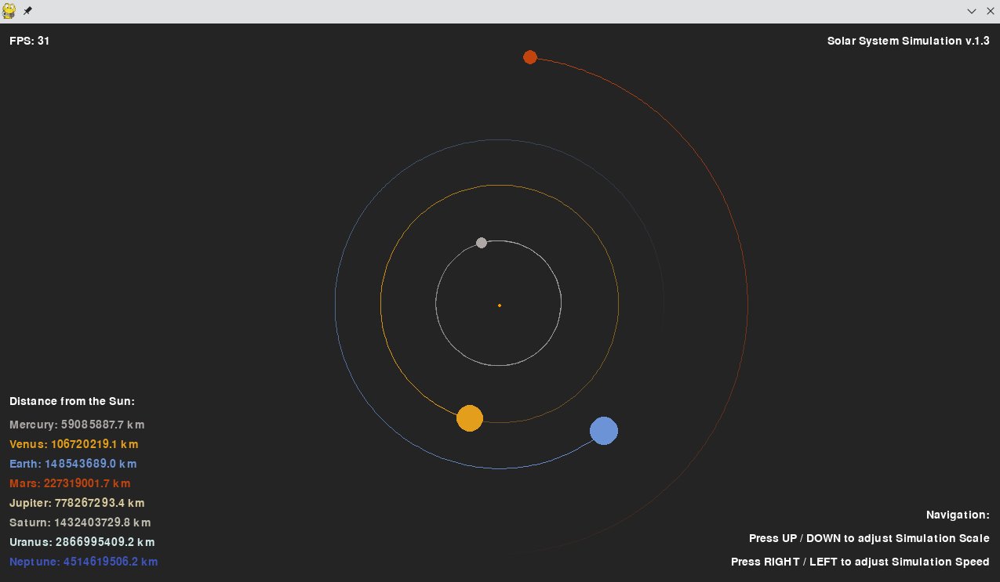

# 2D Solar System Simulation (v1.3)

2D simulation of our solar system using pygame.  
Based on the [YouTube](https://www.youtube.com/watch?v=WTLPmUHTPqo) tutorial by [@techwithtim](https://github.com/techwithtim/Python-Planet-Simulation) and inspired by tweaks and additions by [@zerot69](https://github.com/zerot69/Solar-System-Simulation).

## Screenshot

## Features

- Orbits of inner and outer planets of our solar system
- Using real astronomical data from NASA
- Basic commands to scale and speed up the simulation

## Setup

Install Python packages and run `main.py`.

**Dependencies:**
- pygame
- math
- itertools

## Project Structure

- `main.py` — Main loop, event handling, rendering with enhanced interactive controls
- `constants.py` — Physical constants, colors, planetary data
- `solarsystem_sim.py` — Enhanced Sun, Planet, and Body classes with orbit tracking
- `solarsystem_scale.py` — Scaling and planet size calculations

# Changelog

## v1.3 - Frame Rate Independence & UI Improvements

**Features**

- **Added:** Frame rate independent physics
- **Added:** Improved menu texts and navigation instructions
- **Removed:** Buggy orbit and planet visibility toggles
- **Changed:** Enhanced user interface layout
- **Files:** Basic structure with main simulation files

**Full Changelog**: https://github.com/kuranez/solar-system-simulation/compare/v1.2...v1.3

## v1.2 Enhanced Visuals & Scaling

**Features**

- **Added:** Improved orbit visuals with trail fade effect
- **Added:** Overhauled scaling and zoom system with additional variables
- **Added:** Overhauled solar system creation process
- **Changed:** Better visual representation of planetary orbits
- **Known Issues:** Toggle orbit/planet functionality became buggy

**Full Changelog**: https://github.com/kuranez/solar-system-simulation/compare/v1.1...v1.2

## v1.1 - Size & Resolution Updates

**Features**

- **Added:** Adjusted planet and orbit sizes for better visibility
- **Added:** 720p resolution support (1280x720)
- **Changed:** Improved planet size scaling relative to distances
- **Maintained:** All core simulation features from v1.0

**Full Changelog**: https://github.com/kuranez/solar-system-simulation/compare/v1.0...v1.1

# Sources

- Tech With Tim's tutorial: [YouTube](https://www.youtube.com/watch?v=WTLPmUHTPqo)
- Article by rastr-0: [teletype.in](https://teletype.in/@rastr_0/solar_system)
- Zerot69's Solar System Simulation: [GitHub](https://github.com/zerot69/Solar-System-Simulation)
- Planetary Data from NASA: [nssdc.gsfc.nasa.gov](https://nssdc.gsfc.nasa.gov/planetary/factsheet/)