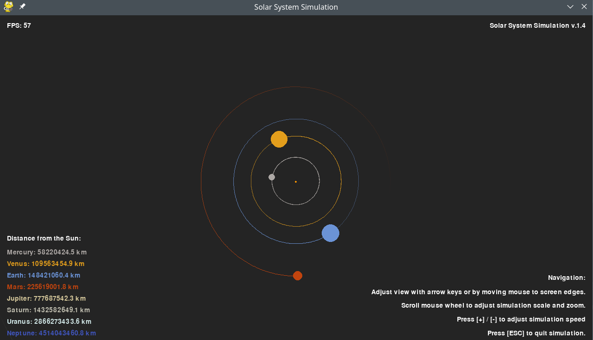

# 2D Solar System Simulation (v1.4)

2D simulation of our solar system using pygame.  
Based on the [YouTube](https://www.youtube.com/watch?v=WTLPmUHTPqo) tutorial by [@techwithtim](https://github.com/techwithtim/Python-Planet-Simulation) and inspired by tweaks and additions by [@zerot69](https://github.com/zerot69/Solar-System-Simulation).

## Screenshot

## Features

- Orbits of inner and outer planets of our solar system
- Uses real astronomical data from NASA
- Scalable zoom: mouse wheel adjusts both orbits and planet sizes (from v1.4)
- Adjustable simulation speed
- Frame-rate independent physics
- Pan view with arrow keys or by moving the mouse to the screen edges
- Color-coded planets and faded orbit trails
- Modular code: separated logic for simulation, scaling, and drawing

## Setup

Install Python packages and run `main.py`.

**Dependencies:**
- pygame
- math
- itertools

## Project Structure

- `main.py` — Main loop, event handling, rendering with enhanced interactive controls
- `constants.py` — Physical constants, colors, planetary data
- `solarsystem_sim.py` — Enhanced Sun, Planet, and Body classes with orbit tracking
- `solarsystem_scale.py` — Scaling and planet size calculations

# Changelog

## [1.4] - 2025-06-27 (Final)

### Current Repository State
This version represents the final v.1.4 release with the following core files:
- `constants.py` — Physical constants, colors, and planetary data
- `main.py` — Main loop, event handling, and rendering
- `solarsystem_scale.py` — Scaling and planet size calculations  
- `solarsystem_sim.py` — Sun, Planet, and Body classes for physics and drawing

### Added
- **Mouse wheel zoom:** Both orbits and planet visuals scale dynamically with zoom
- **Modular architecture:** Separated scaling logic into dedicated `solarsystem_scale.py`
- **Enhanced orbit trails:** Improved fade effect for clearer visualization
- **Real-time planet scaling:** Planet sizes update immediately with zoom changes
- **Unified constants:** Centralized all physical and visual constants

### Changed
- Complete refactoring of zoom and scaling system
- Planet sizes now scale proportionally with zoom level
- Improved code organization and modularity
- Optimized drawing and update loops
- Enhanced user interface with better navigation instructions

### Fixed
- Planet size scaling issues during zoom operations
- Orbit trail fade inconsistencies
- Code redundancy in scaling calculations

---

## Version History Overview

### [1.3] - Frame Rate Independence & UI Improvements
- **Added:** Frame rate independent physics
- **Added:** Improved menu texts and navigation instructions
- **Removed:** Buggy orbit and planet visibility toggles
- **Changed:** Enhanced user interface layout
- **Files:** Basic structure with main simulation files

### [1.2] - Enhanced Visuals & Scaling
- **Added:** Improved orbit visuals with trail fade effect
- **Added:** Overhauled scaling and zoom system with additional variables
- **Added:** Overhauled solar system creation process
- **Changed:** Better visual representation of planetary orbits
- **Known Issues:** Toggle orbit/planet functionality became buggy

### [1.1] - Size & Resolution Updates  
- **Added:** Adjusted planet and orbit sizes for better visibility
- **Added:** 720p resolution support (1280x720)
- **Changed:** Improved planet size scaling relative to distances
- **Maintained:** All core simulation features from v1.0

### [1.0] - Initial Release
- **Core Features:** 
  - Simulation of inner and outer planets
  - Keyboard controls for scale and speed adjustment
  - Toggle functionality for orbits and planets
  - Display of planet distances to the Sun
- **Foundation:** Basic solar system simulation with gravitational physics

---
# Sources

- Tech With Tim's tutorial: [YouTube](https://www.youtube.com/watch?v=WTLPmUHTPqo)
- Article by rastr-0: [teletype.in](https://teletype.in/@rastr_0/solar_system)
- Zerot69's Solar System Simulation: [GitHub](https://github.com/zerot69/Solar-System-Simulation)
- Planetary Data from NASA: [nssdc.gsfc.nasa.gov](https://nssdc.gsfc.nasa.gov/planetary/factsheet/)
