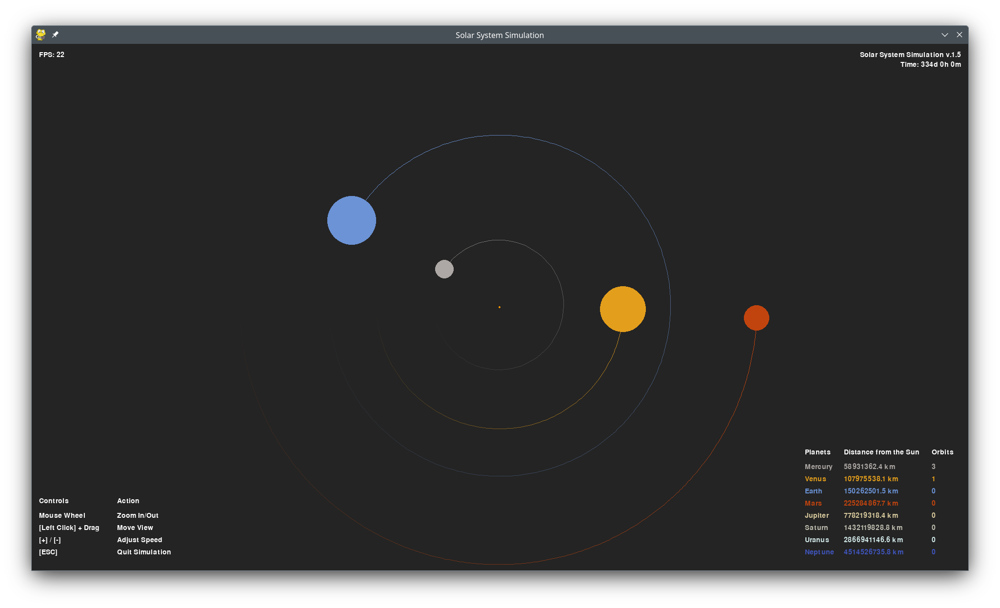

# 2D Solar System Simulation (v1.5)

2D simulation of our solar system using pygame.  
Based on the [YouTube](https://www.youtube.com/watch?v=WTLPmUHTPqo) tutorial by [@techwithtim](https://github.com/techwithtim/Python-Planet-Simulation) and inspired by tweaks and additions by [@zerot69](https://github.com/zerot69/Solar-System-Simulation).

## Screenshot

## Features

- Orbits of inner and outer planets of our solar system
- Uses real astronomical data from NASA
- **Interactive navigation:** Mouse wheel zoom and left-click drag to move view
- **Orbit tracking:** Real-time orbit counter for each planet with completion indicators
- **Enhanced visuals:** Single orbit trail per planet with fade effects
- **Professional UI:** Tabular display of controls and planet information
- **Time tracking:** Real-time simulation time display in years/days/hours/minutes
- **Screenshot support:** Press F12 to capture screenshots directly
- Adjustable simulation speed with keyboard controls
- Frame-rate independent physics
- Color-coded planets with authentic astronomical colors
- Modular code architecture for easy extension

## Setup

Install Python packages and run `main.py`.

**Dependencies:**
- pygame
- math
- itertools

## Project Structure

- `main.py` — Main loop, event handling, rendering with enhanced interactive controls
- `constants.py` — Physical constants, colors, planetary data
- `solarsystem_sim.py` — Enhanced Sun, Planet, and Body classes with orbit tracking
- `solarsystem_scale.py` — Scaling and planet size calculations

# Changelog

## [1.5] - 2025-06-29 (Current Release)

### Current Repository State
This version represents the latest v.1.5 release with enhanced interactivity and user interface improvements:
- `constants.py` — Physical constants, colors, and planetary data
- `main.py` — Main loop, event handling, and rendering with enhanced controls
- `solarsystem_scale.py` — Scaling and planet size calculations  
- `solarsystem_sim.py` — Enhanced Sun, Planet, and Body classes with orbit tracking

### Added
- **Mouse drag navigation:** Left-click and drag to move the view around the solar system
- **Orbit counter system:** Each planet now tracks and displays completed orbits
- **Enhanced orbit visualization:** Only the most recent orbit trail is displayed with visual fade effect
- **Orbit completion indicators:** Flash ring effect when planets complete an orbit
- **Improved menu system:** Tabular layout for controls and planet information
- **Time elapsed indicator:** Real-time display of simulated time in years/days/hours/minutes
- **Screenshot functionality:** Press F12 to save screenshots directly from the simulation
- **Professional UI layout:** Organized display with proper table formatting

### Changed
- Complete overhaul of the user interface with table-based layouts
- Enhanced planet data display showing distance and orbit counts
- Improved navigation controls with clear visual organization
- Optimized orbit trail rendering with memory management
- Better visual feedback for user interactions

### Fixed
- Orbit trail memory leaks by clearing trails on orbit completion
- UI element positioning and alignment issues
- Time tracking accuracy and display formatting

---

## Version History Overview

### [1.4] - Code Organization
- **Added:** Mouse wheel zoom, modular architecture, enhanced orbit trails, real-time planet scaling, unified constants
- **Changed:** Complete refactoring of zoom and scaling system, improved code organization, optimized drawing and update loops, enhanced user interface
- **Fixed:** Planet size scaling issues, orbit trail fade inconsistencies, code redundancy in scaling calculations

### [1.3] - Frame Rate Independence & UI Improvements
- **Added:** Frame rate independent physics
- **Added:** Improved menu texts and navigation instructions
- **Removed:** Buggy orbit and planet visibility toggles
- **Changed:** Enhanced user interface layout
- **Files:** Basic structure with main simulation files

### [1.2] - Enhanced Visuals & Scaling
- **Added:** Improved orbit visuals with trail fade effect
- **Added:** Overhauled scaling and zoom system with additional variables
- **Added:** Overhauled solar system creation process
- **Changed:** Better visual representation of planetary orbits
- **Known Issues:** Toggle orbit/planet functionality became buggy

### [1.1] - Size & Resolution Updates  
- **Added:** Adjusted planet and orbit sizes for better visibility
- **Added:** 720p resolution support (1280x720)
- **Changed:** Improved planet size scaling relative to distances
- **Maintained:** All core simulation features from v1.0

### [1.0] - Initial Release
- **Core Features:** 
  - Simulation of inner and outer planets
  - Keyboard controls for scale and speed adjustment
  - Toggle functionality for orbits and planets
  - Display of planet distances to the Sun
- **Foundation:** Basic solar system simulation with gravitational physics

---
# Sources

- Tech With Tim's tutorial: [YouTube](https://www.youtube.com/watch?v=WTLPmUHTPqo)
- Article by rastr-0: [teletype.in](https://teletype.in/@rastr_0/solar_system)
- Zerot69's Solar System Simulation: [GitHub](https://github.com/zerot69/Solar-System-Simulation)
- Planetary Data from NASA: [nssdc.gsfc.nasa.gov](https://nssdc.gsfc.nasa.gov/planetary/factsheet/)
