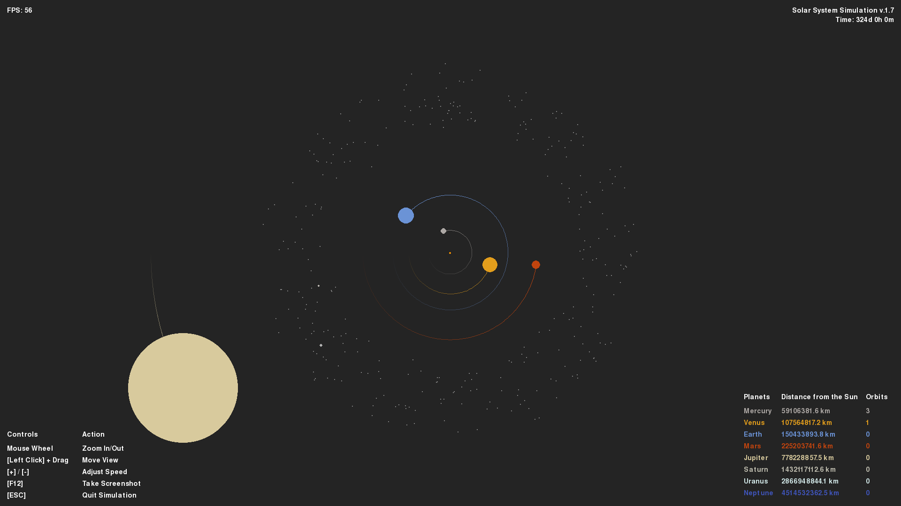

# 2D Solar System Simulation (v1.7)

2D simulation of our solar system using pygame.  
Based on the [YouTube](https://www.youtube.com/watch?v=WTLPmUHTPqo) tutorial by [@techwithtim](https://github.com/techwithtim/Python-Planet-Simulation) and inspired by tweaks and additions by [@zerot69](https://github.com/zerot69/Solar-System-Simulation).

## Screenshot

## Features

- Main planet orbits and asteroid belt, including Ceres & Vesta.
- Uses real astronomical data from NASA 
- **Interactive navigation:** Mouse wheel zoom and left-click drag to move view
- **Orbit tracking:** Real-time orbit counter for each planet with completion indicators
- **Enhanced visuals:** Single orbit trail per planet with fade effects
- **Professional UI:** Tabular display of controls and planet information
- **Time tracking:** Real-time simulation time display in years/days/hours/minutes
- **Screenshot support:** Press F12 to capture screenshots directly
- Adjustable simulation speed with keyboard controls
- Frame-rate independent physics
- Color-coded planets with authentic astronomical colors
- Modular code architecture for easy extension

## Setup

Install Python packages and run `main.py`.

**Dependencies:**
- pygame
- math
- itertools

## Project Structure

- `main.py` — Main loop, event handling, rendering with enhanced interactive controls
- `constants.py` — Physical constants, colors, planetary data
- `solarsystem_sim.py` — Enhanced Sun, Planet, and Body classes with orbit tracking
- `solarsystem_scale.py` — Scaling and planet size calculations

---
# Changelog

### 🚀 What's New in v1.7

Version 1.7 improves asteroid visibility and simulation polish by introducing individually-instantiated major asteroids and a dedicated `Asteroid` class optimized for performance.

### ✨ Added
- `Asteroid` class (`solarsystem_sim.py`) — lightweight asteroid bodies that only compute Sun gravity and use screen-culling for efficient rendering
- Major asteroids: Ceres and Vesta are instantiated as distinct bodies using `constants.ASTEROID_CERES` and `constants.ASTEROID_VESTA`
- `create_major_asteroids()` (in `main.py`) — creates Ceres and Vesta with appropriate semi-major axes, colors and initial velocities
- Improved asteroid belt generation: `create_asteroid_belt()` now generates a configurable number of asteroids (300 by default) between 2.2–3.2 AU
- Planet orbit completion indicator: visual flash when a planet completes an orbit; planets now track orbit counts

### 🔧 Performance & Rendering
- Asteroids only calculate gravitational attraction to the Sun (no planet interactions) for performance
- Screen culling for asteroids avoids drawing off-screen objects
- Asteroids have no orbit trails to save memory and maintain smooth framerates

### 📝 Notes
- The simulation title and in-game time display have been updated to reflect v1.7
- `constants.py` contains `ASTEROID_CERES` and `ASTEROID_VESTA` entries used by v1.7

---

## Version History Overview

### [1.6] - Asteroid Belt Implementation - Nov 20, 2025

- **Added:** Asteroid belt: complete main belt implementation with 300+ objects. Realistic distribution of procedurally generated asteroids between Mars and Jupiter with configurable density, randomized sizes and orbital parameters, and optimized rendering for performance. 
- **Changed:** Optimized physics: Sun-only gravity calculations for asteroids

**Full Changelog**: https://github.com/kuranez/solar-system-simulation/compare/v.1.5...v.1.6

### [1.5] - Improved UI - Jun 29, 2025
- **Added:** Mouse drag navigation, orbit counters, enhanced orbit visualization, orbit completion indicators, improved menu system, time elapsed indicator, screenshot functionality
- **Changed:** UI overhaul with table-based layout, enhanced planet data display, optimized orbit trail rendering
- **Fixed:** Orbit trail memory leaks, UI element positioning, time tracking accuracy

**Full Changelog**: https://github.com/kuranez/solar-system-simulation/compare/v.1.4...v.1.5

### [1.4] - Code Organization - Jun 27, 2025
- **Added:** Mouse wheel zoom, modular architecture, enhanced orbit trails, real-time planet scaling, unified constants
- **Changed:** Complete refactoring of zoom and scaling system, improved code organization, optimized drawing and update loops, enhanced user interface
- **Fixed:** Planet size scaling issues, orbit trail fade inconsistencies, code redundancy in scaling calculations

**Full Changelog**: https://github.com/kuranez/solar-system-simulation/compare/v1.3...v.1.4

### [1.3] - Frame Rate Independence & UI Improvements - Oct 20, 2024
- **Added:** Frame rate independent physics
- **Added:** Improved menu texts and navigation instructions
- **Removed:** Buggy orbit and planet visibility toggles
- **Changed:** Enhanced user interface layout
- **Files:** Basic structure with main simulation files

**Full Changelog**: https://github.com/kuranez/solar-system-simulation/compare/v1.2...v1.3

### [1.2] - Enhanced Visuals & Scaling - Oct 20, 2024
- **Added:** Improved orbit visuals with trail fade effect
- **Added:** Overhauled scaling and zoom system with additional variables
- **Added:** Overhauled solar system creation process
- **Changed:** Better visual representation of planetary orbits
- **Known Issues:** Toggle orbit/planet functionality became buggy

**Full Changelog**: https://github.com/kuranez/solar-system-simulation/compare/v1.1...v1.2

### [1.1] - Size & Resolution Updates  - Jul 31, 2024
- **Added:** Adjusted planet and orbit sizes for better visibility
- **Added:** 720p resolution support (1280x720)
- **Changed:** Improved planet size scaling relative to distances
- **Maintained:** All core simulation features from v1.0

**Full Changelog**: https://github.com/kuranez/solar-system-simulation/compare/v1.0...v1.1

### [1.0] - Initial Release - Jul 23, 2024
- **Core Features:** 
  - Simulation of inner and outer planets
  - Keyboard controls for scale and speed adjustment
  - Toggle functionality for orbits and planets
  - Display of planet distances to the Sun
- **Foundation:** Basic solar system simulation with gravitational physics

**Full Changelog**: https://github.com/kuranez/solar-system-simulation/commits/v1.0

---
# Sources

- Tech With Tim's tutorial: [YouTube](https://www.youtube.com/watch?v=WTLPmUHTPqo)
- Article by rastr-0: [teletype.in](https://teletype.in/@rastr_0/solar_system)
- Zerot69's Solar System Simulation: [GitHub](https://github.com/zerot69/Solar-System-Simulation)
- Planetary Data from NASA: [nssdc.gsfc.nasa.gov](https://nssdc.gsfc.nasa.gov/planetary/factsheet/)
