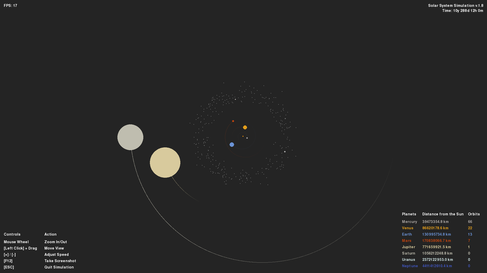

# 2D Solar System Simulation (v1.8)

This Python/Pygame project simulates the solar system using real astronomical data and Newtonian gravity.  Version 1.8 introduces ephemeris-based initialization using data from JPL (via the Skyfield library) so planetary starting positions and velocities are more physically accurate.

Based on the [YouTube](https://www.youtube.com/watch?v=WTLPmUHTPqo) tutorial by [@techwithtim](https://github.com/techwithtim/Python-Planet-Simulation) and inspired by tweaks and additions by [@zerot69](https://github.com/zerot69/Solar-System-Simulation).

---

## Screenshot

## Core Features

- Orbits of inner and outer planets of our solar system
- Uses real astronomical data from NASA 
- **Interactive navigation:** Mouse wheel zoom and left-click drag to move view
- **Orbit tracking:** Real-time orbit counter for each planet with completion indicators
- **Enhanced visuals:** Single orbit trail per planet with fade effects
- **Professional UI:** Tabular display of controls and planet information
- **Time tracking:** Real-time simulation time display in years/days/hours/minutes
- **Screenshot support:** Press F12 to capture screenshots directly
- Adjustable simulation speed with keyboard controls
- Frame-rate independent physics
- Color-coded planets with authentic astronomical colors
- Modular code architecture for easy extension

## Setup

Install Python packages and run `main.py`. 

**Dependencies:**
- pygame
- skyfield
- jplephem
- itertools

## Controls

| Control | Action |
|---------|--------|
| **Mouse Wheel** | Zoom In/Out |
| **Left Click + Drag** | Move View |
| **[+] / [-]** | Adjust Speed |
| **F12** | Take Screenshot |
| **[ESC]** | Quit Simulation |

## Project Structure

- `main.py` — Main loop, event handling, rendering with enhanced interactive controls
- `constants.py` — Physical constants, colors, planetary data
- `solarsystem_sim.py` — Enhanced Sun, Planet, and Body classes with orbit tracking
- `solarsystem_scale.py` — Scaling and planet size calculations
- `de440a.bsp`  — 
- `CHANGELOG.md` — Detailed version changes
- `DOCUMENTATION.md` — Full documentation for current version

## WebApp Demo
 
 Simplified web version based on this project showcasing different planetary system options .
 
 **WebApp:** [https://apps.kuracodez.space/solar-system-sim](https://apps.kuracodez.space/solar-system-sim/app) 
 
 **For more info see:** [https://github.com/kuranez/solar-system-simulation-web](https://github.com/kuranez/solar-system-simulation-web)

---
# Changelog

### 🚀 What's New in v1.8

Version 1.8 marks a major leap in scientific accuracy for the simulation. The initial positions of all planets are now calculated in real-time using high-precision data from NASA's Jet Propulsion Laboratory (JPL), providing an authentic snapshot of the solar system at the moment the simulation begins.

#### 🛰️ **Real-Time Planetary Positions with JPL Ephemerides**
- **High-Precision Data:** Initial planet positions and velocities are now derived from the JPL DE440s ephemeris, the same data used by NASA for space mission navigation.
- **Dynamic Starting Configuration:** Every time you run the simulation, it starts with the planets in their actual current locations in the solar system.
- **Skyfield Integration:** The powerful `skyfield` library has been integrated to handle the complex astronomical calculations, ensuring accuracy and reliability.
- **2D Projection:** The 3D coordinates from the ephemeris are accurately projected onto a 2D plane for visualization.

## Version History Overview

### [1.7] - Major Asteroids Ceres & Vesta - Nov 21, 2025

**Features**

- **Zoom Fix:** Adjusted Simulation Scaling.
- **Added:** Orbit completion indicator. Visual flash, when a planet completes an orbit.
- **Major asteroids:** Added Ceres and Vesta as individual major-asteroid objects.

**Full Changelog**: https://github.com/kuranez/solar-system-simulation/compare/v.1.6...v.1.7

### [1.6] - Asteroid Belt Implementation - Nov 20, 2025

- **Added:** Asteroid belt: complete main belt implementation with 300+ objects. Realistic distribution of procedurally generated asteroids between Mars and Jupiter with configurable density, randomized sizes and orbital parameters, and optimized rendering for performance. 
- **Changed:** Optimized physics: Sun-only gravity calculations for asteroids

**Full Changelog**: https://github.com/kuranez/solar-system-simulation/compare/v.1.5...v.1.6

### [1.5] - Improved UI - Jun 29, 2025
- **Added:** Mouse drag navigation, orbit counters, enhanced orbit visualization, orbit completion indicators, improved menu system, time elapsed indicator, screenshot functionality
- **Changed:** UI overhaul with table-based layout, enhanced planet data display, optimized orbit trail rendering
- **Fixed:** Orbit trail memory leaks, UI element positioning, time tracking accuracy

**Full Changelog**: https://github.com/kuranez/solar-system-simulation/compare/v.1.4...v.1.5

### [1.4] - Code Organization - Jun 27, 2025
- **Added:** Mouse wheel zoom, modular architecture, enhanced orbit trails, real-time planet scaling, unified constants
- **Changed:** Complete refactoring of zoom and scaling system, improved code organization, optimized drawing and update loops, enhanced user interface
- **Fixed:** Planet size scaling issues, orbit trail fade inconsistencies, code redundancy in scaling calculations

**Full Changelog**: https://github.com/kuranez/solar-system-simulation/compare/v1.3...v.1.4

### [1.3] - Frame Rate Independence & UI Improvements - Oct 20, 2024
- **Added:** Frame rate independent physics
- **Added:** Improved menu texts and navigation instructions
- **Removed:** Buggy orbit and planet visibility toggles
- **Changed:** Enhanced user interface layout
- **Files:** Basic structure with main simulation files

**Full Changelog**: https://github.com/kuranez/solar-system-simulation/compare/v1.2...v1.3

### [1.2] - Enhanced Visuals & Scaling - Oct 20, 2024
- **Added:** Improved orbit visuals with trail fade effect
- **Added:** Overhauled scaling and zoom system with additional variables
- **Added:** Overhauled solar system creation process
- **Changed:** Better visual representation of planetary orbits
- **Known Issues:** Toggle orbit/planet functionality became buggy

**Full Changelog**: https://github.com/kuranez/solar-system-simulation/compare/v1.1...v1.2

### [1.1] - Size & Resolution Updates  - Jul 31, 2024
- **Added:** Adjusted planet and orbit sizes for better visibility
- **Added:** 720p resolution support (1280x720)
- **Changed:** Improved planet size scaling relative to distances
- **Maintained:** All core simulation features from v1.0

**Full Changelog**: https://github.com/kuranez/solar-system-simulation/compare/v1.0...v1.1

### [1.0] - Initial Release - Jul 23, 2024
- **Core Features:** 
  - Simulation of inner and outer planets
  - Keyboard controls for scale and speed adjustment
  - Toggle functionality for orbits and planets
  - Display of planet distances to the Sun
- **Foundation:** Basic solar system simulation with gravitational physics

**Full Changelog**: https://github.com/kuranez/solar-system-simulation/commits/v1.0

---
# Sources

- Tech With Tim's tutorial: [YouTube](https://www.youtube.com/watch?v=WTLPmUHTPqo)
- Article by rastr-0: [teletype.in](https://teletype.in/@rastr_0/solar_system)
- Zerot69's Solar System Simulation: [GitHub](https://github.com/zerot69/Solar-System-Simulation)
- Planetary Data from NASA: [nssdc.gsfc.nasa.gov](https://nssdc.gsfc.nasa.gov/planetary/factsheet/)

